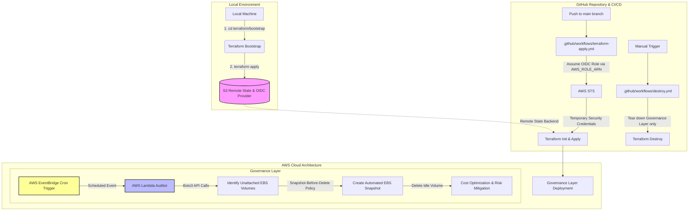

AWS Governance: Automated EBS Auditor
A production-ready, serverless framework that identifies unattached (idle) EBS volumes, secures their data via automated snapshots, and operates with zero-credential security using OIDC.

Here is the workflow.

🚀 Business Value & Efficiency
Cost Optimization: Automatically targets "available" EBS volumes that accrue costs without providing value.

Risk Mitigation: Ensures a "Snapshot-Before-Delete" policy, providing data durability while reducing storage overhead.

Operational Excellence: Replaces manual infrastructure audits with an EventBridge-driven schedule.

Enhanced Security: Implements OIDC (OpenID Connect) to eliminate the need for long-lived AWS Access Keys in CI/CD.

Project Architecture
This project is split into two distinct layers for maximum stability:

The Bootstrap Layer: Sets up the foundational OIDC trust relationship and the S3 Remote State "Lockbox."

The Governance Layer: Deploys the Python-based Lambda auditor and the EventBridge cron-trigger.

🛠️ Tech Stack
Infrastructure: Terraform

Language: Python 3.x (Boto3)

CI/CD: GitHub Actions

Security: IAM OIDC Identity Provider

Compute: AWS Lambda (Serverless)

Plaintext
.
├── .github/workflows
│   ├── terraform-apply.yml    # Automated deployment
│   └── destroy.yml            # Manual teardown trigger
├── terraform
│   ├── bootstrap              # One-time setup (OIDC/S3)
│   ├── environments
│   │   └── prod               # Production configuration & backend
│   └── modules
│       └── resource-auditor   # Reusable Lambda & IAM logic

Deployment Instructions
1. The "Hand of God" Bootstrap
Run this locally once to establish the cloud identity:

Bash
cd terraform/bootstrap
terraform init
terraform apply
2. Configure GitHub Secrets
Add the following secret to your GitHub Repository:

AWS_ROLE_ARN: The ARN of the OIDC Role created in the bootstrap phase.

3. Automated Apply
Simply push to the main branch. GitHub Actions will:

Assume the OIDC role.

Initialize the remote S3 backend.

Deploy/Update the Auditor Lambda.

Cleanup
To avoid unwanted costs, use the Manual Destroy workflow in the GitHub Actions tab. This will tear down the governance resources while keeping the OIDC identity intact for future use.

The Architect's Note
"This project demonstrates the transition from manual cloud management to Infrastructure as Code (IaC). By isolating the identity layer from the functional layer, we've created a resilient pipeline that can be destroyed and recreated in seconds with 100% consistency."

