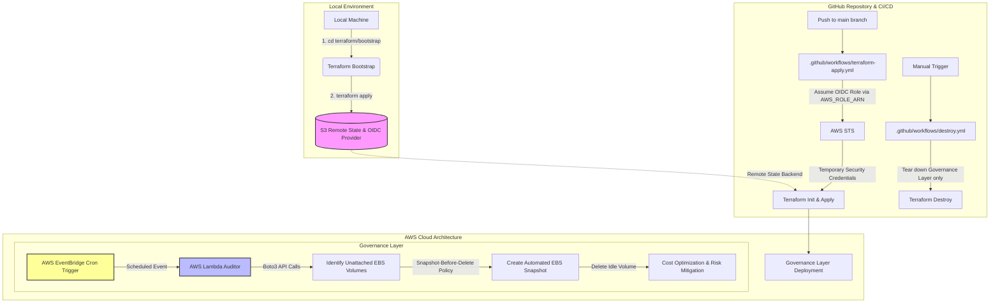

```mermaid
graph TD
    subgraph Local Environment
        A[Local Machine] -->|1. cd terraform/bootstrap| B(Terraform Bootstrap)
        B -->|2. terraform apply| C[(S3 Remote State & OIDC Provider)]
    end

    subgraph GitHub Repository & CI/CD
        D[Push to main branch] --> E[.github/workflows/terraform-apply.yml]
        F[Manual Trigger] --> G[.github/workflows/destroy.yml]
        
        E -->|Assume OIDC Role via AWS_ROLE_ARN| H[AWS STS]
        H -->|Temporary Security Credentials| I[Terraform Init & Apply]
        
        G -->|Tear down Governance Layer only| J[Terraform Destroy]
    end

    subgraph AWS Cloud Architecture
        C -.->|Remote State Backend| I
        I --> K[Governance Layer Deployment]
        
        subgraph Governance Layer
            L[AWS EventBridge Cron Trigger] -->|Scheduled Event| M[AWS Lambda Auditor]
            M -->|Boto3 API Calls| N[Identify Unattached EBS Volumes]
            N -->|Snapshot-Before-Delete Policy| O[Create Automated EBS Snapshot]
            O -->|Delete Idle Volume| P[Cost Optimization & Risk Mitigation]
        end
    end

    style C fill:#f9f,stroke:#333,stroke-width:2px
    style M fill:#bbf,stroke:#333,stroke-width:2px
    style L fill:#ff9,stroke:#333,stroke-width:2px
```
